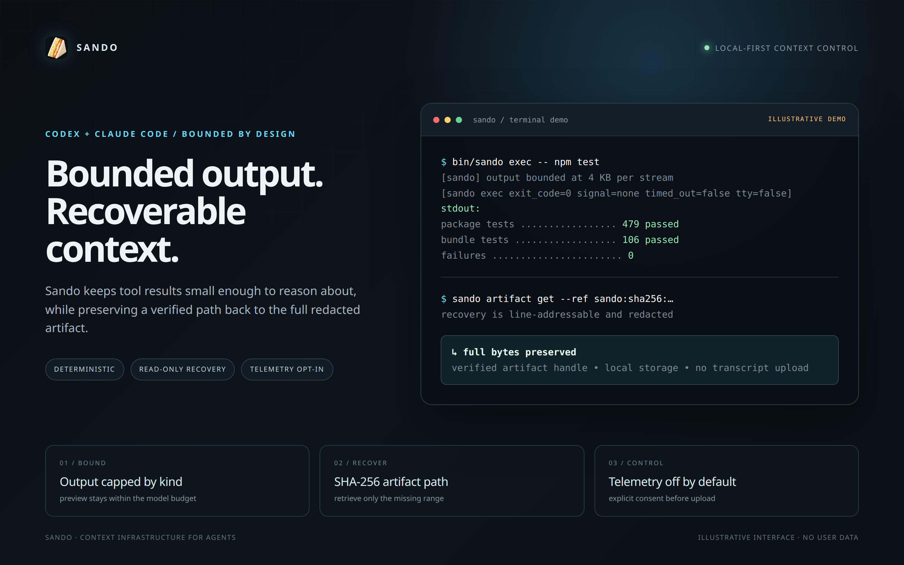

<p align="center">
  
</p>

# Sando

[](https://github.com/yuzushi-dev/Sando/actions/workflows/hol-plugin-scanner.yml)
[](https://github.com/yuzushi-dev/Sando/actions/workflows/hol-plugin-scanner.yml)

**Context-management plugin for Claude Code and Codex. It bounds what a tool result costs before that result reaches the model.**

Large output is truncated to a cap set by the kind of content it is, the full bytes are kept on
disk with a verified hash, and the lines that answer the question — error lines, test totals —
are pulled out of the part that was cut. The default path is deterministic and local; the optional
TypeSafe shadow judge is measurement-only and never changes the request.

<p align="center">
  <a href="sando-promo.mp4">
    
  </a>
</p>
<p align="center">
  <a href="sando-promo.mp4">▶ Watch the 21-second demo</a>
</p>

## Expected savings

| Surface | Reduction | Measured over | Reproduce |
|---|---|---|---|
| Codex shell output | **90.9%** (78.5M → 7.2M tokens) | 40,000+ recorded results | `node scripts/bench-codex-shell.mjs` |
| Claude `PostToolUse` tool results | **14.5% – 18.9%** | two machines | [`docs/measurements.md`](docs/measurements.md) |
| Files fitting a 200,000-token window | **~2.4x more** (2.39x–2.44x) | any git checkout | `node scripts/bench-reduction.mjs` |

These are output reductions, one tool result at a time. What a session costs also depends on
prompt-cache economics, which these numbers do not model. Results from external `mcp__*` tools
pass through untouched and are excluded. Method and per-corpus variation:
[`docs/measurements.md`](docs/measurements.md).

## Install

Requirements: Claude Code or Codex, and Node.js `>=22.22.0 <23` with `node` on `PATH`
(`node --version`). Each marketplace source ships its hooks and bundles, so there is no build
step.

**Claude Code** — run in the session:

```text
/plugin marketplace add yuzushi-dev/yuzushi-plugins
/plugin install sando@yuzushi
```

**Codex**:

```bash
codex plugin marketplace add yuzushi-dev/yuzushi-plugins
```

Then open `/plugins`, select `sando`, and install/enable it. Start a new session if Codex was
already open.

On Codex the `PostToolUse` hook cannot rewrite output at all, so Sando bounds shell output by
rewriting the command before it runs. That is on by default; `SANDO_CLI_ROUTING=0` switches it
off. What the rewrite preserves is measured rather than assumed: exit codes, death by signal,
standard input, stderr and the resulting working tree all match the unwrapped run across 1,290
recorded commands, and binary output is withheld rather than bounded. See
[`docs/measurements.md`](docs/measurements.md#does-the-codex-wrap-preserve-what-it-wraps).
Approval is untouched — Codex handles that through a separate `PermissionRequest` event.

## What you get

- **Bounded tool results.** Every result is capped by content kind before the model sees it.
- **Nothing is lost.** Full bytes go to a content-addressed store with a verified hash; the
  bounded result carries the command to fetch back whatever was cut.
- **The answer survives the cut.** `npm test` here prints 595 test results across two summary
  blocks, 120 KB in total. Bounded, the model sees 4 KB and still answers *585 passed, 0 failed*,
  because the totals are salvaged out of the elided middle. Before that salvage existed, the same
  model read the surviving block and answered *100 passed*, with nothing to mark the omission.
- **Secrets redacted first,** with project-local detectors in `.sando/redaction.json`.
- **Composes, doesn't compete.** It acts on tool results only, so it stacks with output filters
  or scope rules.
- **Accounting you can check.** Provider-reported tokens and mechanical trimming are recorded
  separately; mechanical reduction is never turned into a provider-billing claim.
- **Semantic supervision with TypeSafe Jev (optional).** Sub-second System One decision
  guards that catch unverified completion claims (`Done-Guard`, strictly grounded in actual test
  telemetry) and intercept repetitive retry loops (`Stuck-Guard`), with automatic secret redaction
  and fail-open offline fallback.

## Architecture in brief

```
host (Claude PostToolUse hook | Codex shell routing)
        │  tool result
        ▼
   redaction ──► bound to a per-kind cap ──► salvage errors + totals
        │                                          │
        ▼                                          ▼
  artifact store (sha256, on disk)          preview to the model
        │                                     + recovery handle
        └──► sando artifact get / sando_artifact_get (MCP)
```

- **Three bundles**, one per host surface: `adapters/claude/sando`, `adapters/codex/sando`,
  `plugins/sando`. Each carries `hooks/`, `mcp/`, `bin/`, `lib/`. The `lib/` trees are synced
  from the single source in `packages/sando/src` by `scripts/sync-bundles.mjs`.
- **MCP server** exposes read-only artifact recovery, plus optional Slice symbol tools when a
  natively built engine is configured.
- **Each host wires only what its manifest declares:** the hooks and the MCP surfaces. The
  provider proxy and the Lazy MCP Gateway are separate processes that no host starts — you launch
  them yourself or they never run. The CLI, audit, artifact recovery, statusline, metrics and
  accounting launchers are likewise manual entrypoints. Sando changes no Claude or Codex global
  configuration, and telemetry is off until you choose.

Release notes: [Sando 0.6.0](docs/changelogs/0.6.0.md). Development branch: `release/0.6.0`.
Telemetry is off by default — see the [full disclosure](TELEMETRY.md).

---

<details>
<summary><b>Reference: Slice symbol reads and opt-in writes</b></summary>

Slice connects Sando's MCP to a separately built native symbol engine. Build the
tested engine from a Sando source checkout with Bash, Git, Make, CMake 3.24+ and GCC 13+
(C and C++ compilers). The verified target is Ubuntu 24.04 on Linux x86-64;
other operating systems, architectures and toolchains are not verified by Sando.

```bash
# Run from the Sando checkout. The destination must not already exist.
bash scripts/build-slice.sh "$HOME/sando-slice"
```

The script fetches [upstream source at commit
`d90acb2cb3295da8ca0fd33a88e81cb51a8575fb`](https://github.com/redhat-et/ripwire/tree/d90acb2cb3295da8ca0fd33a88e81cb51a8575fb),
checks the revision and builds with vendored dependencies and CMake downloads
disabled. It retains the source and its licenses, refuses an existing destination,
and leaves a failed build in place for diagnosis. Expect several minutes of
compilation, several GB of RAM, and space for the source and build tree. It does not install hooks,
modify host configuration or install a binary globally.

Build on the machine where the MCP server runs: the executable uses that system's
C/C++ runtime libraries. This is a pinned source build, not a promise of identical
binary bytes across compilers or portability to older distributions. The native
engine is Apache-2.0, with dependency notices in its `THIRD_PARTY.md` and
`third_party/` license files; Sando's JavaScript remains MIT. Keep those notices
with any redistributed native artifact. The plugin and npm library contain no
native executable.

Configure the MCP server environment with the resulting absolute executable path
and a canonical workspace directory:

```bash
SANDO_SLICE_BINARY=/absolute/path/to/sando-slice/build/ripwire
SANDO_SLICE_ROOT=/absolute/path/to/workspace
SANDO_SLICE_WRITE=1
```

Without a valid binary and root, no Slice tools are advertised. Omit
`SANDO_SLICE_WRITE` for read-only use. Codex runs the engine inside the host's
managed restricted sandbox; missing sandbox metadata is refused.

Read tools are `sando_slice_for`, `sando_slice_find_symbol`,
`sando_slice_find_referencing_symbols`, and `sando_slice_fetch_body` (at most 400
body-relative lines per call). Writes are `sando_slice_replace_symbol_body` and
`sando_slice_insert_after_symbol`.

Find the symbol, fetch its body, then pass its `sym#…@…` identifier as the write's
`handle`. Plain names are not accepted for writes. Replacement covers exactly
the fetched definition span: preserve modifiers such as `export` that sit
outside it instead of adding them again. Stale handles are refused; read again
and reconsider the edit. Insertion before a definition is not exposed.

Slice applies Sando's project redaction rules to results and errors. Redacted
source is marked as non-round-trippable and its handle cannot be used for replacement.
The engine's handles, freshness metadata, and edit receipts are otherwise preserved.
`post_check` provides static feedback, not a test run; run project tests after
editing. If a write is interrupted or loses its response, inspect the file
before retrying: cancellation does not imply rollback.

Native integration checks use temporary workspaces. The Codex cases additionally
require the Codex CLI on `PATH` and a working host sandbox (Bubblewrap on Linux);
they are skipped when Codex is absent. CI provides both and runs every native case:

```bash
SANDO_SLICE_TEST_BINARY="$HOME/sando-slice/build/ripwire" npm test
```

Bash previews also remove ANSI formatting and retain bounded error diagnostics
from omitted output, prioritizing failures over warnings. Full admitted
artifacts retain the original redacted output; ANSI formatting is also removed
there when necessary to redact a credential split by escape sequences.

</details>

<details>
<summary><b>Reference: result progressive disclosure and artifact recovery</b></summary>

Recover a bounded byte or line range from an installed workspace artifact:

```bash
/path/to/installed/sando/bin/sando artifact get --root . --ref sando:sha256:... --start-line 1 --end-line 40 --json
# Claude bundle: node /path/to/installed/sando/artifact.mjs artifact get --root . --ref sando:sha256:... --json
```

From inside a session, the MCP server exposes the same recovery as the read-only
`sando_artifact_get` tool, for artifacts kept in that MCP process.

**Limits.** Bytes are kept for any result up to the 1 MiB artifact limit. Beyond that, and beyond
the 16 MiB a wrapped command captures, the excess is truncated at the source and marked as such.
The limit is an admission threshold, not a truncation target: if the complete redacted result
exceeds it, Sando keeps a bounded preview, issues no artifact handle, and marks recovery
unavailable rather than pretending a partial artifact is complete. On writes it removes entries
older than seven days and caps retained artifacts at 64 MiB, touching only regular
content-addressed files and never following symlinks.

**What the model sees.** The library and MCP result APIs attach a `sando-result-disclosure/v1`
record — redacted byte counts, provenance, elision markers, and the digest handle, never the
payload. Claude and Codex hook responses stay host-native and carry no disclosure metadata;
errors, current results, IDs, order, batches, and binary status are untouched.

</details>

<details>
<summary><b>Reference: experimental surfaces, not started by any host</b></summary>

Two surfaces ship in the bundle but are never launched by Claude Code or Codex. Neither is
production-ready, and neither is covered by the savings table.

**Lazy MCP Gateway.** A replacement surface for explicitly allowlisted external MCP servers, not
a wrapper around host built-ins. Configure `SANDO_MCP_GATEWAY_CONFIG` with JSON (or an explicit
JSON file path) containing `enabled`, `allowlist`, and `servers` entries with `command`/`args`,
then run `node packages/sando/gateway.mjs`. Do not expose the same MCPs through the host at the
same time. Roll back by stopping the process and removing the gateway MCP entry; `enabled: false`
is the safe kill switch. It supports initialize, ping, tools/list, catalog discovery, and
allowlisted `tools/call` through `sando_call`; other downstream paths fail closed, and auth,
approval and elicitation are intentionally unsupported. The production gate remains
`insufficient-evidence`, evaluated by `sando context gateway-gate` against a
`sando-progressive-gateway-evidence/v1` file.

**Provider proxy.** The context/history transformer behind an explicit launcher, for hosts that
support a configured local base URL. It archives older tool observations across turns. Codex
transport is untouched unless you point the client at the proxy's printed local URL:

```bash
SANDO_UPSTREAM_URL=https://api.example.test \
SANDO_PROXY_TRANSFORM=1 \
SANDO_CONTEXT_POLICY='{"maxHistoryTokens":1000}' \
/path/to/installed/sando/bin/sando-proxy
```

Request transformation is off unless `SANDO_PROXY_TRANSFORM=1`; individual transform families can
be disabled with `SANDO_CONTEXT_POLICY.strategies`. For the opt-in footprint record, also set
`SANDO_CONTEXT_FOOTPRINT_PATH`, `SANDO_CONTEXT_FOOTPRINT_HOST` (`claude` or `codex`) and an
explicit `SANDO_CONTEXT_SESSION_KEY`; the record contains no request content, and without a
session key the capture is skipped. For the local Grafana cockpit, set `SANDO_F1_TELEMETRY=1`
with the loopback-only `SANDO_F1_TELEMETRY_ENDPOINT=http://127.0.0.1:4319/v1/logs`; only
coverage and size buckets leave the capture process.

For an opt-in TypeSafe/Jev shadow measurement, install the optional `pi-typesafe` package in the
launcher environment and set `SANDO_TYPESAFE_SHADOW=1` together with `SANDO_PROXY_TRANSFORM=1`.
Sando sends only redacted, bounded samples
of eligible historical results and their deterministic previews. Jev reports whether diagnostic
evidence may have been lost; it never changes the forwarded request. The judge is fail-open and
disables itself when the package or key is unavailable. `SANDO_PROJECT_ROOT` selects the project
whose `.sando/redaction.json` should be applied; `SANDO_TYPESAFE_TIMEOUT_MS` and
`SANDO_TYPESAFE_MAX_REQUESTS` bound the optional calls. This is a measurement surface, not a
general prompt-injection guard or a semantic summarizer.

The offline semantic-quality test uses labeled diagnostic facts and an injected judge to compare
the deterministic preview with a loss-gated preview. It verifies the gate's trade-off, not Jev's
model accuracy, and never enables live request gating:
`node --test packages/sando/tests/semantic-quality.test.mjs`.

What the replays measured, and why it is not a savings claim, is in
[`docs/measurements.md`](docs/measurements.md).

</details>

<details>
<summary><b>Reference: project redaction rules</b></summary>

Teams can add project-local detectors in `.sando/redaction.json`:

```json
{
  "schema": "sando-redaction/v1",
  "rules": [
    { "type": "assignment-key", "key": "DATABASE_URL" },
    { "type": "token-prefix", "prefix": "acme_", "minLength": 24, "maxLength": 128 }
  ]
}
```

Built-in detectors remain enabled. The supported declarative rules are `assignment-key` and `token-prefix`; both use the fixed `[REDACTED]` placeholder. The profile is loaded from the current project only, and its digest is recorded in receipts. Invalid profiles are reported instead of silently ignored.

</details>


<details>
<summary><b>Reference: TypeSafe Jev supervised guards (Done-Check & Stuck-Loop)</b></summary>

Sando supports optional semantic supervision powered by [TypeSafe AI](https://typesafe.ai/) (System One model Jev) to protect agent coding workflows:

- **Done-Guard:** Evaluates whether an agent claims completion while files were modified without a passing verification command recorded in Sando telemetry.
- **Stuck-Guard:** Detects consecutive failing tools. Identical retries trigger deterministically at Tier 1 (0 ms, 0 API calls). Ambiguous variations of failing strategies are evaluated by Jev at Tier 2.

### Configuration (Option B: User Home Configuration)

Users configure their personal API key in their private home directory (`~/.config/typesafe/auth.json`), keeping keys strictly outside of repository working trees:

```bash
mkdir -p ~/.config/typesafe
cat << 'EOF' > ~/.config/typesafe/auth.json
{
  "api_key": "YOUR_PERSONAL_TYPESAFE_KEY"
}
EOF
chmod 600 ~/.config/typesafe/auth.json
```

Alternatively, set the `TYPESAFE_API_KEY` environment variable. Run `node plugins/sando/bin/verify-typesafe-live.mjs` to verify your setup.

### Privacy & Fail-Open Semantics
- **Zero credential leaks:** Both state and question payloads undergo bidirectional regex secret redaction (`[REDACTED]`) locally before any network transmission.
- **Strict Fail-Open:** If unconfigured, unreachable, or timed out (>1500 ms), guards automatically degrade to local deterministic heuristics without blocking the session or throwing unhandled errors.

</details>
